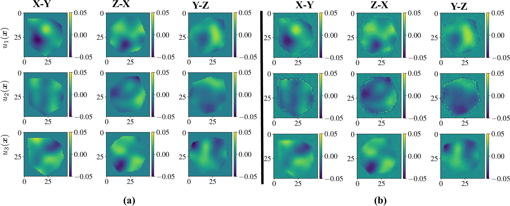

# `mrbcdi` [](https://zenodo.org/badge/latestdoi/516969894)
## Differentiable,  multi-reflection Bragg coherent diffraction imaging (BCDI) for lattice distortion fields in crystals
Directly reconstruct the electron density and the deviatoric lattice distortion in compact crystals from independent BCDI data sets measured at a synchrotron facility. 
	Useful for imaging isolated dislocations such as edge and screw disloca
Written in Python + Pytorch. 




### Reference
S. Maddali _et al_, **A differentiable forward model for the concurrent, multi-peak Bragg coherent x-ray diffraction imaging problem**, 2022. 
([preprint](https://doi.org/10.48550/arXiv.2208.00970))

### System requirements
...as determined by [pipreqs](https://github.com/bndr/pipreqs):

```
    h5py==2.10.0
    logzero==1.7.0
    matplotlib==3.3.4
    numpy==1.20.1
    pyfftw==0.13.0
    scipy==1.6.2
    torch==1.10.0	
    tqdm==4.62.3
```

### Tutorials
The [notebooks](https://github.com/siddharth-maddali/mrbcdi/tree/main/notebooks) folder contains basic reconstruction tutorials. 
