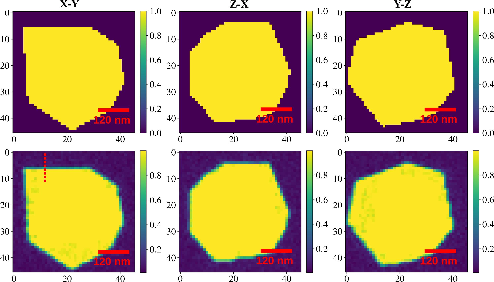

# `mrbcdi` 
## Differentiable,  multi-reflection Bragg coherent diffraction imaging (BCDI) for lattice distortion fields in crystals
Directly reconstruct the electron density and the deviatoric lattice distortion in compact crystals from independent BCDI data sets measured at a synchrotron facility. 
	Useful for imaging isolated dislocations such as edge and screw disloca
Written in Python + Pytorch. 




### Reference 
S. Maddali _et al_, **A differentiable forward model for the concurrent, multi-peak Bragg coherent x-ray diffraction imaging problem**, 2022. 
[](https://doi.org/10.48550/arXiv.2208.00970)

[Datasets](https://github.com/siddharth-maddali/mrbcdi/tree/main/data) and [reconstructions](https://github.com/siddharth-maddali/mrbcdi/tree/main/reconstructions) are available here through the Git LFS system and citeable on Zenodo: [](https://zenodo.org/badge/latestdoi/516969894)
Alternately, the datasets may be downloaded from [here](https://anl.box.com/s/hyoufk4hkdzrbls37drzjjrnwm5519im). 


### System requirements
#### Software
Python modules, as determined by [pipreqs](https://github.com/bndr/pipreqs):

```
    h5py==2.10.0
    logzero==1.7.0
    matplotlib==3.3.4
    numpy==1.20.1
    pyfftw==0.13.0
    scipy==1.6.2
    torch==1.10.0	
    tqdm==4.62.3
```

#### Hardware
These are based on what was available to me at the time of creating this repo. 
   
   1. CPU: Intel Xeon CPU E5-2623 v4 @ 2.60GHz or better. 
   1. GPU: Nvidia GeForce GTX 1650 or better. 


### Tutorials
The [notebooks](https://github.com/siddharth-maddali/mrbcdi/tree/main/notebooks) folder contains complete reconstruction tutorials, including dataset descriptions. 

### Acknowledgements

   1. Dr. Stephan Hruszkewycz (ANL)
   1. Dr. Saugat Kandel (ANL)

